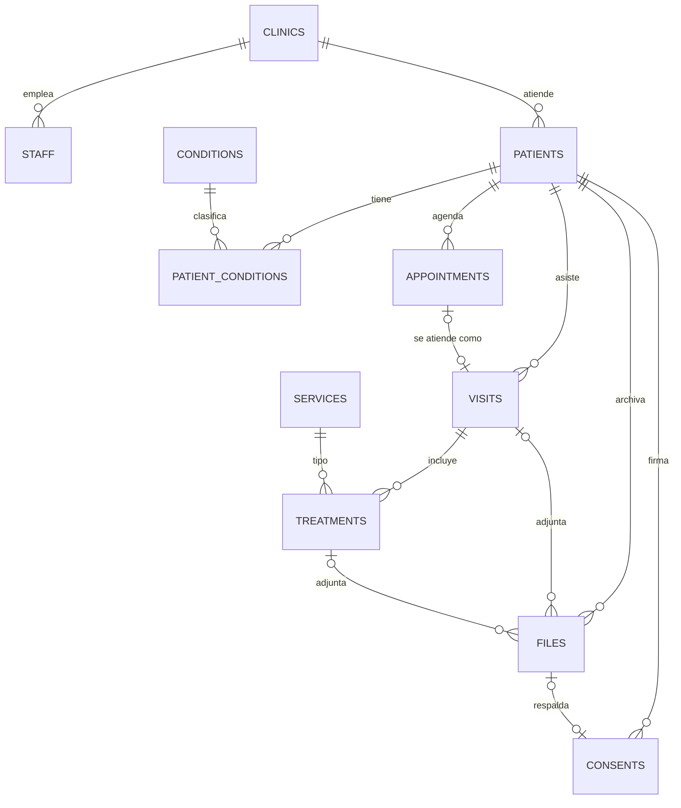

# Spec 01 · Modelo de datos

| | |
|---|---|
| **Proyecto** | Goldent · Sistema de historias clínicas |
| **Estado** | ✅ 0001 en Supabase (2026-10-04) · ⏳ 0002 por aplicar |
| **Migraciones** | `supabase/migrations/0001_initial_schema.sql`, `0002_align_with_design.sql` |
| **Alcance** | MVP · 1 clínica · 1 usuaria (la odontóloga) |

## 1. Objetivo

Reemplazar la historia clínica en papel por registros digitales que la doctora pueda **crear, buscar y consultar en segundos** desde una tablet, incluyendo la digitalización manual de las historias antiguas.

## 2. Decisiones de diseño

| # | Decisión | Motivo |
|---|---|---|
| D1 | Todas las tablas llevan `clinic_id` | Hoy hay 1 clínica; permite crecer sin migrar. No se modelan sedes. |
| D2 | La edad **no se guarda**, se calcula desde `birth_date` | Evita datos desactualizados. |
| D3 | **Nada clínico se borra**: sin política DELETE, se usa `deleted_at` | La historia clínica debe conservarse. |
| D4 | `record_number` automático (`HC-00001`, 5 dígitos desde 0002) + `legacy_record_number` opcional | Correlativo limpio y búsqueda por el H.Cl. escrito en el papel. |
| D5 | **Cita ≠ visita**. `visits.appointment_id` es opcional | Cita = lo agendado. Visita = la atención real. |
| D6 | Antecedentes con `active` (no soft delete) | Se marcan y desmarcan; el historial queda en `audit_log`. |
| D7 | Pieza dental en notación **FDI** (`treatments.tooth`) | Estándar odontológico; prepara el odontograma futuro. |
| D8 | Catálogos globales (`clinic_id = null`) | Condiciones y servicios del formato en papel, compartidos. |
| D9 | Ingreso **100% manual**, sin OCR | La foto del papel solo se archiva (`files.kind = 'paper_record'`). |

## 3. Diagrama

## 4. Tablas

### `clinics`
Datos de la clínica. `record_seq` es el contador interno de historias clínicas.

`id` · `name` · `ruc` (único) · `phone` · `address` · `logo_path` · `record_seq` · `created_at` · `updated_at`

### `staff`
Usuarios del sistema, 1:1 con `auth.users`.

| Campo | Tipo | Regla |
|---|---|---|
| `id` | uuid | = `auth.users.id` |
| `clinic_id` | uuid | FK `clinics` |
| `full_name` | text | requerido |
| `role` | text | `owner` · `dentist` · `assistant` (default `dentist`) |
| `active` | bool | si es `false`, pierde acceso a todo |

### `patients`
Sección "Identificación del paciente" del formato.

| Campo | Tipo | Regla |
|---|---|---|
| `record_number` | text | **automático** `HC-00001`, inmutable, único por clínica |
| `legacy_record_number` | text | H.Cl. del papel, opcional |
| `first_names`, `last_names` | text | requeridos |
| `dni` | text | 8 dígitos, opcional, único por clínica (entre activos) |
| `birth_date` | date | no futura |
| `sex` | text | `F` · `M` |
| `phone` | text | celular (WhatsApp) |
| `email`, `address`, `occupation`, `notes` | text | opcionales |
| `marital_status` | text | `soltero` · `casado` · `conviviente` · `divorciado` · `viudo` |
| `deleted_at` | timestamptz | soft delete |

### `conditions` (catálogo) y `patient_conditions`
Sección "Ud. sufre de". `needs_detail` indica que la UI debe pedir un campo de detalle; `is_alert` indica que se muestra como badge en la ficha.

Seed: Alergias, Diabetes, Hemorragias, Presión alta/baja, Úlcera gástrica, Enfermedad cardiaca, Recibe medicamento, Otra enfermedad, Embarazada. Desde 0002 todas aceptan detalle.

`patient_conditions`: `patient_id` · `condition_id` · `detail` · `active`. Único por (paciente, condición).

### `services` (catálogo)
Lista "Servicios profesionales" del formato (19 ítems). Desde 0002, `category` coincide con los grupos de chips de Nueva visita: Restauraciones, Endodoncia, Prótesis, Prevención y estética, Cirugía, Ortodoncia, Diagnóstico y otros. `requires_tooth = true` en resinas, endodoncias, biopulpotomía, perno e implantes: la UI pide pieza dental. `default_price` queda reservado para la fase de cobros.

### `appointments`
| Campo | Regla |
|---|---|
| `starts_at`, `ends_at` | `ends_at > starts_at` |
| `status` | `scheduled` · `confirmed` · `done` · `cancelled` · `no_show` |
| `reason`, `notes`, `deleted_at` | |

### `visits`
"Fecha de atención" + "Motivo de su visita".

| Campo | Regla |
|---|---|
| `visit_date` | default hoy |
| `appointment_id` | opcional y único. `null` = llegó sin cita |
| `reason`, `notes`, `deleted_at` | |

### `treatments`
Tabla "Tratamiento efectuado", **sin montos**.

| Campo | Regla |
|---|---|
| `visit_id` | requerido |
| `service_id` | FK `services` |
| `tooth` | FDI válido: permanentes 11–48, deciduos 51–85. Opcional |
| `status` | `planned` · `in_progress` · `done` (default `done`) |

### `files`
Metadata de archivos; el binario vive en Storage.

| Campo | Regla |
|---|---|
| `kind` | `paper_record` · `xray` · `photo` · `consent` · `other` |
| `storage_path` | `{clinic_id}/{patient_id}/{file_id}.webp`, único |
| `visit_id`, `treatment_id` | opcionales |
| `page_number` | para historias en papel de varias hojas |
| `mime_type`, `size_bytes`, `caption`, `taken_at`, `deleted_at` | |

### `consents`
Consentimiento informado. `method`: `paper` (default) · `digital`. `file_id` apunta a la foto del documento firmado. Vigente = el más reciente por `signed_at`.

### `audit_log`
Registro automático de INSERT/UPDATE/DELETE con `old_data`, `new_data`, `changed_by` y `changed_at`. Solo lectura para la clínica.

## 5. Reglas automáticas (triggers)

| Regla | Dónde |
|---|---|
| Asigna `HC-XXXXX` correlativo por clínica, sin colisiones | insert en `patients` |
| Bloquea cambios a `record_number` y `clinic_id` | update en `patients` |
| Al crear una visita con `appointment_id`, la cita pasa a `done` | insert en `visits` |
| Actualiza `updated_at` | tablas editables |
| Escribe en `audit_log` | `patients`, `patient_conditions`, `appointments`, `visits`, `treatments`, `files`, `consents` |
| `clinic_id` se completa solo con la clínica del usuario | default en tablas clínicas |
| Integridad cruzada: una visita, tratamiento o archivo no puede apuntar a un paciente de otra clínica | FKs compuestas `(clinic_id, id)` |

## 6. Seguridad

- **RLS activo en todas las tablas.** El acceso se resuelve con `current_clinic_id()`: la clínica del usuario logueado en `staff` (si está `active`).
- Tablas clínicas: SELECT, INSERT y UPDATE solo dentro de su clínica. **Sin DELETE.**
- Catálogos: lectura de globales + los de su clínica.
- **Storage**: bucket `patient-files` privado, máx. 5 MB, solo `webp`, `jpeg`, `png` y `pdf`. Lectura y subida solo en la carpeta `{clinic_id}/`. Acceso del front con signed URLs.
- Datos de salud = datos sensibles (Ley 29733). Nunca exponer la `service_role key` en el front.

## 7. Casos de uso → datos

| Caso de uso | Operación |
|---|---|
| **Buscar paciente** | `rpc('search_patients', { q })`: nombre con tolerancia a tildes y errores ("gonsales" → "Gonzáles"), DNI parcial, celular, `HC-00001` o H.Cl. del papel. Máx. 20. Devuelve tarjetas JSON: `id, record_number, legacy_record_number, first_names, last_names, dni, phone, age, alerts[], last_visit`. |
| **Recientes (Inicio)** | `rpc('recent_patients', { max_results: 6 })`: misma tarjeta, por última actividad. |
| **Ver ficha** | `patients` + `patient_conditions` (activos, con `is_alert` como badges) + `visits` con `treatments` (desc por fecha) + `files` + último `consents`. Edad desde `birth_date`. |
| **Nuevo paciente** | insert `patients` (sin enviar `record_number`) + inserts en `patient_conditions` |
| **Captura rápida** | insert `patients` con `legacy_record_number` → subir fotos a Storage → insert `files` (`kind = 'paper_record'`, `page_number`) |
| **Nueva visita** | insert `visits` → un insert en `treatments` por servicio y por pieza. Pedir `tooth` si `services.requires_tooth`; boca completa = `tooth` null. |
| **Atender cita** | insert `visits` con `appointment_id` (la cita se cierra sola) |
| **No asistió** | update `appointments.status = 'no_show'` |
| **Eliminar** | update `deleted_at = now()` |

## 8. Fuera de alcance (este entregable)

Cobros (presupuesto, abono, saldo), odontograma interactivo, OCR, firma digital, multi-sede, portal de pacientes.

**Preparado para después:** `services.default_price` → tablas `budgets`/`payments`; `treatments.tooth` en FDI → tabla `odontogram_entries`; `consents.method = 'digital'` → firma en tablet.

## 9. Alta inicial

1. Crear el usuario de la doctora en Authentication > Users.
2. Ejecutar el bloque de la sección 13 del script con su email: crea la clínica y la vincula en `staff`.
